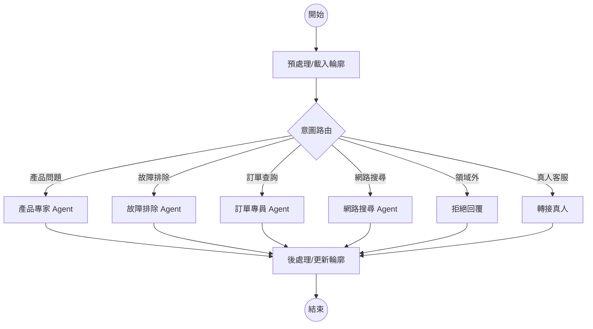

# Smart Lock AI Agent 開發指南

本專案是一個基於 **LangGraph** 建構的智慧電子鎖 AI 客服系統，整合了 RAG (檢索增強生成)、多 Agent 協作、以及 LINE Bot 服務。系統具備意圖自動路由、平行處理多項請求、訊息防抖 (Debounce) 等進階功能。

## 專案概覽

- **核心技術 stack**: Python, LangGraph, FastAPI, ChromaDB, OpenAI/Gemini/Ollama, LINE Messaging SDK v3。
- **架構模式**: 採用「路由 → 專職 Agent」的多 Agent 架構，並支援透過 `Send()` 進行平行派發。
- **主要功能**:
    - **產品專家**: 回答規格與設定問題（RAG）。
    - **故障排除**: 診斷設備問題並提供步驟（RAG + Slot Filling）。
    - **訂單專員**: 透過 API 查詢訂單與維修進度。
    - **網路搜尋**: 當內部資料不足時，自動搜尋外部資訊。
    - **使用者輪廓**: 自動從對話中學習並持久化使用者資訊（設備、地址、電話）。
    - **訊息防抖**: 在 LINE 環境下緩衝使用者連續發送的多則短訊息，合併後再處理。

## 系統架構圖 (LangGraph)



## 快速開始與建置

### 1. 環境設定
- 複製 `.env.example` 並填入 `GEMINI_API_KEY` 或其他 LLM 金鑰。
- 確保安裝依賴：`pip install -r requirements.txt`

### 2. 初始化資料庫 (RAG)
執行以下指令建立向量資料庫：
```bash
python seed_db.py
```
這會建立 `./chroma_db_default` (產品手冊) 與 `./chroma_db_troubleshoot` (故障排除)。

### 3. 執行測試與服務
- **CLI 測試 (劇本展示)**:
  ```bash
  python main.py
  ```
- **啟動 LINE Bot Webhook**:
  ```bash
  uvicorn app:app --reload
  ```
- **啟動 Mock API (測試訂單查詢用)**:
  ```bash
  uvicorn mock_api:app --port 8001
  ```

## 開發慣例與規範

### 1. 設定驅動開發 (Config-Driven)
- 絕大多數的邏輯（意圖定義、Agent 配置、檢索器優先順序）都定義在 `config.toml` 中。
- **新增 Agent**: 在 `config.toml` 的 `[[agents]]` 區塊定義名稱、工具與 Prompt 路徑，並在 `[[intents]]` 增加對應路由即可。

### 2. Prompt 管理
- 所有 Agent 的 System Prompt 存放於 `agents/prompts/` 下的 `.md` 檔案中。修改這些檔案即可調整 Agent 行為。

### 3. 狀態管理 (State)
- 專案使用 `graph/state.py` 定義全域狀態。
- `history` 欄位用於追蹤執行路徑，`chat_history` 用於維護對話上下文。
- 支援 `topic_resolved` 標記，用於觸發 session 遞增。

### 4. 測試實務
- 進行重大變更後，優先執行 `python main.py` 檢查劇本是否正常運作。
- 訊息防抖邏輯可透過 `pytest tests/test_debounce.py` 進行測試。

## 關鍵檔案說明

- `app.py`: FastAPI 入口，處理 LINE Webhook、訊息緩衝與 Loading 動畫。
- `graph/builder.py`: LangGraph 圖表的核心建構邏輯。
- `graph/nodes.py`: 各個節點（Router, Agent, Post-process）的具體實作。
- `tools/`: 封裝了 ChromaDB、API、Web Search 的檢索邏輯與 transfer_to_human 工具（一檔案一工具）。
- `core/config.py`: 負責解析 `config.toml` 並提供全域配置物件。
- `user_profiles/`: 存放持久化的使用者個人化資訊 (JSON 格式)。
