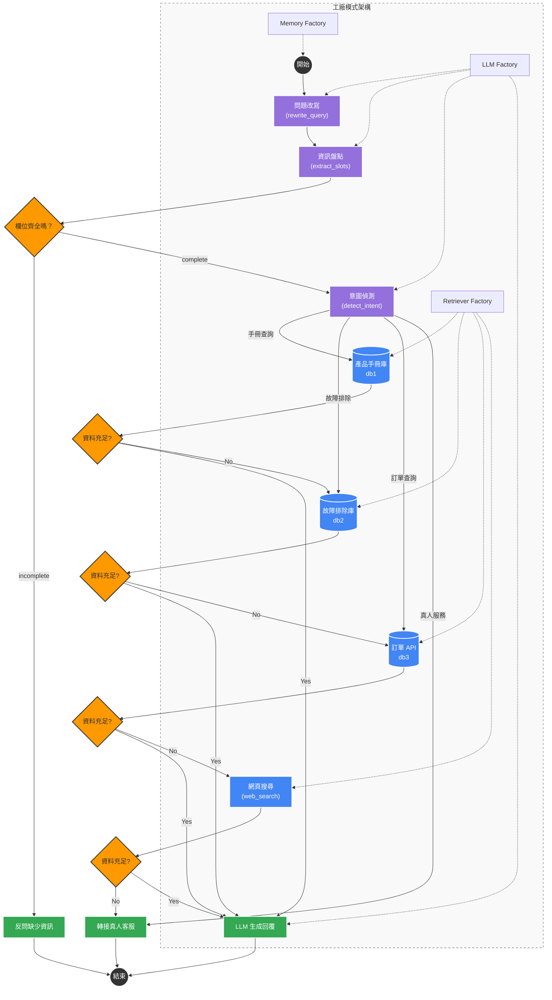

### 1. 系統架構與流程圖 (Mermaid)



---

### 2. 專案目錄結構樹狀圖 (Directory Tree)

```text
my_rag_project/
│
├── config.toml               # 系統大腦核心設定檔 (驅動所有工廠與路由)
├── .env                      # 敏感環境變數 (API Keys 等)
├── main.py                   # 測試與執行入口 (乾淨無邏輯)
│
├── core/                     # 核心設定解析
│   ├── __init__.py
│   └── config.py             # 負責將 TOML 轉為 Python 變數匯出
│
├── graph/                    # LangGraph 對話心智圖流程
│   ├── __init__.py
│   ├── state.py              # 狀態定義 (GraphState, 包含槽位與歷史紀錄)
│   ├── nodes.py              # 節點邏輯 (改寫、盤點、判斷、生成)
│   └── builder.py            # 圖表建構器 (組裝節點與條件路由)
│
├── llms/                     # 語言模型工廠 (LLM Factory)
│   ├── __init__.py           # 註冊表
│   ├── ollama_model.py
│   └── gemini_model.py
│
├── memory/                   # 對話記憶工廠 (Checkpointer Factory)
│   ├── __init__.py           # 註冊表 (支援 Memory, SQLite, Postgres)
│
├── embeddings/               # 向量模型工廠 (Embedding Factory)
│   ├── __init__.py           # 註冊表
│   └── ollama_embed.py
│
├── retrievers/               # 檢索器工廠 (Retriever Factory)
│   ├── __init__.py           # 註冊表
│   ├── base.py               # 抽象基底類別 (BaseRetriever)
│   ├── chroma_store.py       # 向量資料庫檢索
│   ├── api_store.py          # API 即時檢索
│   └── web_search.py         # DuckDuckGo 網頁搜尋
│
└── docs/                     # 開發文件區
    ├── config_guide.md       # 設定檔參數說明
    ├── AI_DEVELOPER_GUIDE.md # AI 助手擴充指南
    └── architecture.md       # 架構圖與目錄結構 (本文件)

```